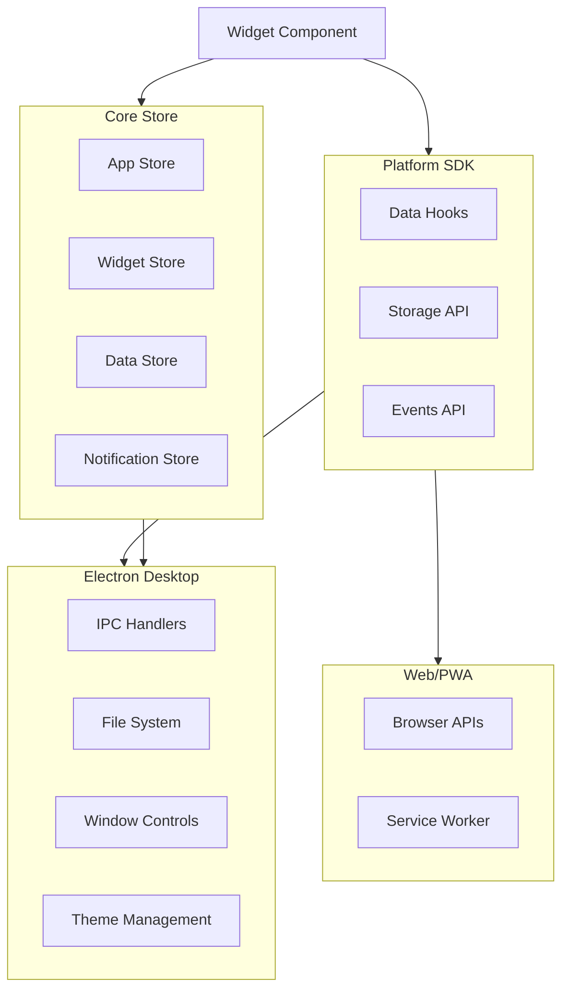

# API Documentation

## Purpose

This document provides a comprehensive reference for all APIs, IPC handlers, and data access methods available in the Business Dashboard platform. It covers Electron IPC channels, SDK methods, data hooks, and store actions that act as APIs.

## Overview

The Business Dashboard platform exposes APIs through multiple layers:

1. **Electron IPC Handlers** - Desktop-specific APIs for window management, file system, and native features
2. **SDK Data Hooks** - React hooks for REST APIs, WebSockets, and file system access
3. **Widget Storage API** - Persistent storage for widget data
4. **Store Actions** - Zustand store actions that provide state management APIs
5. **Platform Capabilities API** - Platform detection and feature availability

## Workflow

### API Architecture



## Electron IPC API

### Window Management

All window management handlers are registered in ```16:39:apps/desktop/src/ipc/index.ts```.

#### `window:minimize`
Minimizes the main window.

**Handler**: `ipcMain.handle("window:minimize")`  
**Returns**: `void`

#### `window:maximize`
Toggles window maximization state.

**Handler**: `ipcMain.handle("window:maximize")`  
**Returns**: `void`

#### `window:close`
Closes the main window.

**Handler**: `ipcMain.handle("window:close")`  
**Returns**: `void`

#### `window:isMaximized`
Checks if the window is maximized.

**Handler**: `ipcMain.handle("window:isMaximized")`  
**Returns**: `boolean`

### Theme Management

Theme handlers are registered in ```41:57:apps/desktop/src/ipc/index.ts```.

#### `theme:get`
Gets the current theme mode.

**Handler**: `ipcMain.handle("theme:get")`  
**Returns**: `"light" | "dark"`

#### `theme:set`
Sets the theme mode.

**Handler**: `ipcMain.handle("theme:set", (_event, theme: "light" | "dark" | "system"))`  
**Parameters**:
- `theme`: `"light" | "dark" | "system"`

**Returns**: `boolean`

#### `theme:changed` (Event)
Emitted when the system theme changes.

**Event**: `mainWindow.webContents.send("theme:changed", theme)`  
**Payload**: `"light" | "dark"`

### File System API

File system handlers are registered in ```59:185:apps/desktop/src/ipc/index.ts```.

#### `fs:showOpenDialog`
Shows a file open dialog.

**Handler**: `ipcMain.handle("fs:showOpenDialog", (_event, options: Electron.OpenDialogOptions))`  
**Parameters**:
- `options`: `Electron.OpenDialogOptions`

**Returns**: `Electron.OpenDialogReturnValue`

#### `fs:showSaveDialog`
Shows a file save dialog.

**Handler**: `ipcMain.handle("fs:showSaveDialog", (_event, options: Electron.SaveDialogOptions))`  
**Parameters**:
- `options`: `Electron.SaveDialogOptions`

**Returns**: `Electron.SaveDialogReturnValue`

#### `fs:readFile`
Reads a text file.

**Handler**: `ipcMain.handle("fs:readFile", async (_event, filePath: string))`  
**Parameters**:
- `filePath`: `string` - Path to the file

**Returns**: `{ success: boolean; content?: string; error?: string }`

#### `fs:writeFile`
Writes a text file.

**Handler**: `ipcMain.handle("fs:writeFile", async (_event, filePath: string, data: string))`  
**Parameters**:
- `filePath`: `string` - Path to the file
- `data`: `string` - Content to write

**Returns**: `{ success: boolean; error?: string }`

#### `fs:readBinary`
Reads a binary file.

**Handler**: `ipcMain.handle("fs:readBinary", async (_event, filePath: string))`  
**Parameters**:
- `filePath`: `string` - Path to the file

**Returns**: `{ success: boolean; data?: Buffer; error?: string }`

#### `fs:listDirectory`
Lists directory contents.

**Handler**: `ipcMain.handle("fs:listDirectory", async (_event, dirPath: string))`  
**Parameters**:
- `dirPath`: `string` - Directory path

**Returns**: `{ success: boolean; files?: FileEntry[]; error?: string }`

**FileEntry Structure**:
```typescript
{
  name: string;
  path: string;
  size: number;
  isDirectory: boolean;
  modifiedAt: number;
  createdAt: number;
}
```

#### `fs:exists`
Checks if a file or directory exists.

**Handler**: `ipcMain.handle("fs:exists", async (_event, filePath: string))`  
**Parameters**:
- `filePath`: `string` - Path to check

**Returns**: `{ success: boolean; exists: boolean }`

#### `fs:watchFile`
Watches a file for changes.

**Handler**: `ipcMain.handle("fs:watchFile", (_event, filePath: string, watchId: string))`  
**Parameters**:
- `filePath`: `string` - Path to watch
- `watchId`: `string` - Unique watch identifier

**Returns**: `{ success: boolean; error?: string }`

**Events**: Emits `fs:watch:${watchId}` with payload:
```typescript
{
  type: "change" | "rename";
  path: string;
  content?: string; // For change events
}
```

#### `fs:unwatchFile`
Stops watching a file.

**Handler**: `ipcMain.handle("fs:unwatchFile", (_event, watchId: string))`  
**Parameters**:
- `watchId`: `string` - Watch identifier to remove

**Returns**: `{ success: boolean }`

### Notifications API

Notification handler is registered in ```187:198:apps/desktop/src/ipc/index.ts```.

#### `notifications:show`
Shows a native notification.

**Handler**: `ipcMain.handle("notifications:show", (_event, title: string, body: string, _options?: object))`  
**Parameters**:
- `title`: `string` - Notification title
- `body`: `string` - Notification body
- `options`: `object` (optional) - Additional options

**Returns**: `boolean` - `true` if notification was shown

### App Info API

App info handlers are registered in ```200:207:apps/desktop/src/ipc/index.ts```.

#### `app:getVersion`
Gets the application version.

**Handler**: `ipcMain.handle("app:getVersion")`  
**Returns**: `string`

#### `app:getName`
Gets the application name.

**Handler**: `ipcMain.handle("app:getName")`  
**Returns**: `string`

## SDK Data Hooks

### REST API Hook

The REST API hook is exported from ```packages/sdk/src/data```.

#### `useRestApi<T>(config: RestApiConfig, options?: UseRestApiOptions<T>): UseRestApiResult<T>`

Fetches data from a REST API endpoint with caching and automatic refresh.

**Configuration** (`RestApiConfig`):
```typescript
{
  type: "rest";
  id: string;
  url: string;
  method?: "GET" | "POST" | "PUT" | "PATCH" | "DELETE";
  headers?: Record<string, string>;
  refreshInterval?: number; // ms, 0 = no refresh
  cacheTtl?: number; // ms
  timeout?: number; // ms
  enabled?: boolean;
}
```

**Options** (`UseRestApiOptions<T>`):
```typescript
{
  initialData?: T;
  fetchOnMount?: boolean;
  transform?: (data: unknown) => T;
  body?: unknown;
  onSuccess?: (data: T) => void;
  onError?: (error: Error) => void;
}
```

**Returns** (`UseRestApiResult<T>`):
```typescript
{
  data: T | undefined;
  status: "idle" | "loading" | "success" | "error";
  error: Error | null;
  isLoading: boolean;
  isSuccess: boolean;
  isError: boolean;
  refetch: () => Promise<void>;
  invalidate: () => Promise<void>;
}
```

### WebSocket Hook

The WebSocket hook is exported from ```packages/sdk/src/data```.

#### `useWebSocket<T>(config: WebSocketConfig, options?: UseWebSocketOptions<T>): UseWebSocketResult<T>`

Manages a WebSocket connection with auto-reconnect and message handling.

**Configuration** (`WebSocketConfig`):
```typescript
{
  type: "websocket";
  id: string;
  url: string;
  protocols?: string | string[];
  reconnect?: boolean;
  maxReconnectAttempts?: number; // 0 = infinite
  reconnectDelay?: number; // ms
  maxReconnectDelay?: number; // ms
  heartbeatInterval?: number; // ms, 0 = disabled
  enabled?: boolean;
}
```

**Options** (`UseWebSocketOptions<T>`):
```typescript
{
  connectOnMount?: boolean;
  transform?: (data: unknown) => T;
  onMessage?: (data: T) => void;
  onOpen?: (event: Event) => void;
  onClose?: (event: CloseEvent) => void;
  onError?: (event: Event) => void;
}
```

**Returns** (`UseWebSocketResult<T>`):
```typescript
{
  lastMessage: T | undefined;
  messages: T[];
  status: "idle" | "connecting" | "connected" | "disconnected" | "error";
  isConnected: boolean;
  send: (data: unknown) => void;
  sendJson: (data: unknown) => void;
  connect: () => void;
  disconnect: () => void;
}
```

### File System Hook

The file system hook is exported from ```packages/sdk/src/data``` and is only available in Electron.

#### `useFileSystem(config: FileSystemConfig, options?: UseFileSystemOptions): UseFileSystemResult`

Provides file system access in Electron environments.

**Configuration** (`FileSystemConfig`):
```typescript
{
  type: "filesystem";
  id: string;
  basePath?: string;
  allowedExtensions?: string[];
  enabled?: boolean;
}
```

**Options** (`UseFileSystemOptions`):
```typescript
{
  basePath?: string;
  encoding?: BufferEncoding;
}
```

**Returns** (`UseFileSystemResult`):
```typescript
{
  isAvailable: boolean;
  status: "idle" | "loading" | "success" | "error";
  error: Error | null;
  readFile: (path: string) => Promise<string>;
  readBinary: (path: string) => Promise<ArrayBuffer>;
  writeFile: (path: string, content: string) => Promise<void>;
  listDirectory: (path: string) => Promise<FileInfo[]>;
  watchFile: (path: string, callback: (event: FileWatchEvent) => void) => () => void;
  exists: (path: string) => Promise<boolean>;
}
```

## Widget Storage API

The storage API is exported from ```packages/sdk/src/storage.ts```.

### `WidgetStorage` Interface

```typescript
interface WidgetStorage {
  get<T = unknown>(key: string): Promise<T | undefined>;
  set<T = unknown>(key: string, value: T, options?: StorageSetOptions): Promise<void>;
  remove(key: string): Promise<void>;
  has(key: string): Promise<boolean>;
  keys(): Promise<string[]>;
  clear(): Promise<void>;
}
```

### Storage Methods

#### `get<T>(key: string): Promise<T | undefined>`
Retrieves a value from widget-scoped storage.

#### `set<T>(key: string, value: T, options?: StorageSetOptions): Promise<void>`
Stores a value in widget-scoped storage.

**Options**:
```typescript
{
  ttl?: number; // Time-to-live in milliseconds
}
```

#### `remove(key: string): Promise<void>`
Removes a value from storage.

#### `has(key: string): Promise<boolean>`
Checks if a key exists.

#### `keys(): Promise<string[]>`
Gets all keys for the widget.

#### `clear(): Promise<void>`
Clears all storage for the widget.

### Observable Storage

The `ObservableWidgetStorage` interface extends `WidgetStorage` with change notifications:

```typescript
interface ObservableWidgetStorage extends WidgetStorage {
  subscribe(listener: StorageChangeListener): () => void;
}
```

Storage keys are automatically namespaced using the pattern: `widget:${widgetId}:${key}`.

## Store Actions API

### App Store

The app store is exported from ```packages/core/src/store/appStore.ts```.

#### Actions

- `toggleSidebar(): void` - Toggles sidebar collapsed state
- `setSidebarCollapsed(collapsed: boolean): void` - Sets sidebar state
- `setCurrentTenant(tenantId: string | null): void` - Sets current tenant
- `setPreferences(preferences: Partial<UserPreferences>): void` - Updates user preferences
- `addRecentWidget(widgetId: string): void` - Adds widget to recent list
- `reset(): void` - Resets store to initial state

#### State

```typescript
{
  sidebarCollapsed: boolean;
  currentTenant: string | null;
  preferences: UserPreferences;
  recentWidgets: string[];
}
```

### Widget Store

The widget store is exported from ```packages/core/src/store/widgetStore.ts```.

#### Actions

- `addWidget(instance: WidgetInstance): void` - Adds a widget instance
- `removeWidget(instanceId: string): void` - Removes a widget instance
- `updateWidgetConfig(instanceId: string, config: Record<string, unknown>): void` - Updates widget config
- `setWidgetLoading(instanceId: string, loadingState: WidgetLoadingState, error?: Error | null): void` - Sets loading state
- `setFocusedWidget(instanceId: string | null): void` - Sets focused widget
- `clearWidgets(): void` - Clears all widgets

#### Selectors

- `selectWidgetInstance(instanceId: string)` - Get widget instance
- `selectWidgetLoading(instanceId: string)` - Get loading state
- `selectAllWidgetIds()` - Get all widget IDs
- `selectWidgetsByTenant(tenantId: string)` - Get widgets by tenant
- `selectWidgetIdsByTenant(tenantId: string)` - Get widget IDs by tenant
- `selectWidgetInstanceForTenant(tenantId: string, instanceId: string)` - Get tenant-scoped instance

### Data Store

The data store is exported from ```packages/core/src/store/dataStore.ts```.

#### Actions

- `setCache<T>(key: string, data: T, ttl?: number): void` - Caches data with TTL
- `getCache<T>(key: string): T | undefined` - Gets cached data
- `invalidateCache(key: string): void` - Invalidates cache entry
- `clearCache(): void` - Clears all cache
- `setRequestState(key: string, state: RequestState, error?: Error | null): void` - Sets request state
- `isCacheValid(key: string): boolean` - Checks if cache is valid

#### Selectors

- `selectCacheEntry<T>(key: string)` - Get cache entry
- `selectRequestState(key: string)` - Get request state
- `selectError(key: string)` - Get error for key

**Default TTL**: 5 minutes (300,000 ms)

### Notification Store

The notification store provides toast notification functionality.

#### Actions

- `toast(message: string, variant?: ToastVariant): void` - Shows a toast
- `dismiss(id: string): void` - Dismisses a toast
- `clear(): void` - Clears all toasts

## Platform Capabilities API

Platform capabilities are detected in ```packages/core/src/platform/capabilities.ts```.

### Detection Functions

- `isElectron(): boolean` - Checks if running in Electron
- `isWeb(): boolean` - Checks if running in web browser
- `isPWA(): boolean` - Checks if running as installed PWA
- `hasFileSystemAccess(): boolean` - Checks if file system access is available
- `hasNotifications(): boolean` - Checks if notifications are available
- `hasOfflineSupport(): boolean` - Checks if service worker is available
- `getPlatformName(): string` - Returns "Desktop", "App", or "Web"

### `detectCapabilities(): PlatformCapabilities`

Returns comprehensive platform capabilities:

```typescript
{
  isElectron: boolean;
  isWeb: boolean;
  isPWA: boolean;
  features: {
    fileSystem: boolean;
    notifications: boolean;
    systemTray: boolean;
    offline: boolean;
  };
}
```

## Examples

### Using REST API Hook

```typescript
import { useRestApi } from "@platform/sdk";

function MyWidget() {
  const { data, isLoading, error, refetch } = useRestApi(
    {
      type: "rest",
      id: "user-data",
      url: "https://api.example.com/users",
      method: "GET",
      refreshInterval: 30000, // 30 seconds
      cacheTtl: 60000, // 1 minute
    },
    {
      fetchOnMount: true,
      onSuccess: (data) => console.log("Data loaded:", data),
    }
  );

  if (isLoading) return <Spinner />;
  if (error) return <Alert>{error.message}</Alert>;
  return <div>{JSON.stringify(data)}</div>;
}
```

### Using WebSocket Hook

```typescript
import { useWebSocket } from "@platform/sdk";

function LiveDataWidget() {
  const { lastMessage, isConnected, sendJson } = useWebSocket(
    {
      type: "websocket",
      id: "live-updates",
      url: "wss://api.example.com/ws",
      reconnect: true,
      maxReconnectAttempts: 5,
    },
    {
      connectOnMount: true,
      onMessage: (data) => console.log("Received:", data),
    }
  );

  return (
    <div>
      <div>Status: {isConnected ? "Connected" : "Disconnected"}</div>
      <div>Last: {JSON.stringify(lastMessage)}</div>
      <button onClick={() => sendJson({ type: "ping" })}>Ping</button>
    </div>
  );
}
```

### Using File System Hook (Electron)

```typescript
import { useFileSystem } from "@platform/sdk";

function FileViewerWidget() {
  const { readFile, listDirectory, isAvailable } = useFileSystem({
    type: "filesystem",
    id: "file-viewer",
    basePath: "/Users/me/Documents",
  });

  if (!isAvailable) {
    return <div>File system not available</div>;
  }

  const handleRead = async () => {
    const content = await readFile("example.txt");
    console.log(content);
  };

  return <button onClick={handleRead}>Read File</button>;
}
```

### Using Widget Storage

```typescript
import { useWidgetStorage } from "@platform/sdk";

function SettingsWidget() {
  const storage = useWidgetStorage();

  const saveSettings = async () => {
    await storage.set("theme", "dark", { ttl: 86400000 }); // 24 hours
  };

  const loadSettings = async () => {
    const theme = await storage.get<string>("theme");
    console.log("Theme:", theme);
  };

  return <div>Settings Widget</div>;
}
```

## References

- [Electron IPC Documentation](https://www.electronjs.org/docs/latest/api/ipc-main)
- [Zustand Store Documentation](https://github.com/pmndrs/zustand)
- [React Hooks Documentation](https://react.dev/reference/react)
- See [SCHEMA.md](../schemas/SCHEMA.md) for data model definitions
- See [V2-MAPPING.md](../schemas/V2-COMPONENT-MAPPING.md) for Next.js mapping
- See [ARCHITECTURE.md](./ARCHITECTURE.md) for system architecture

