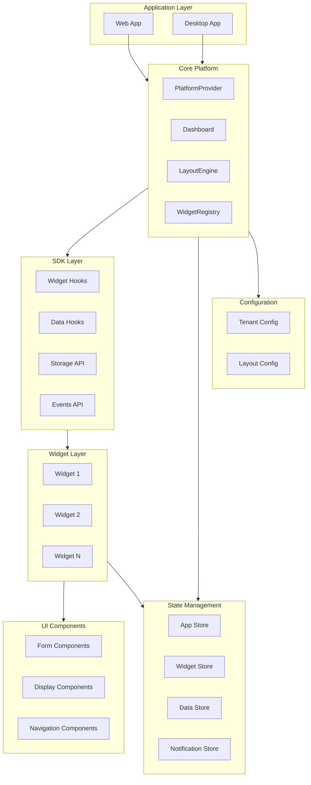
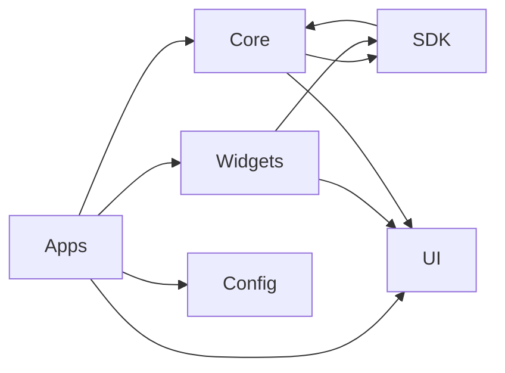
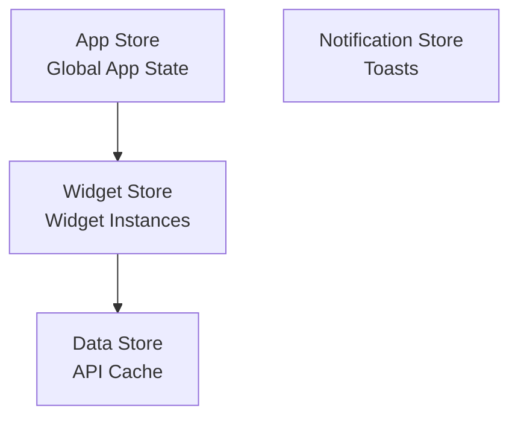
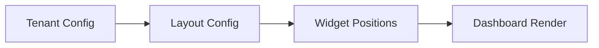
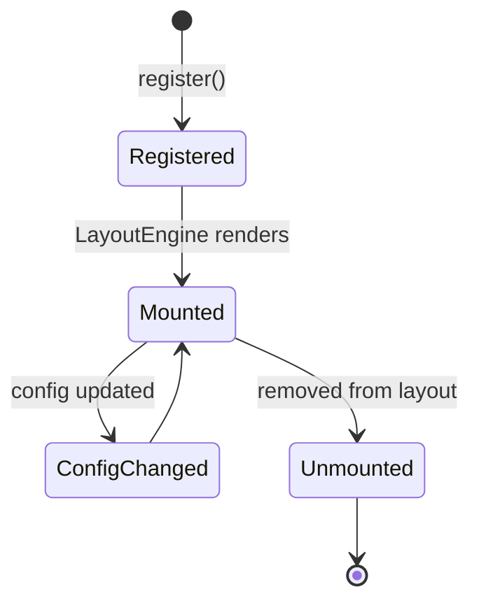
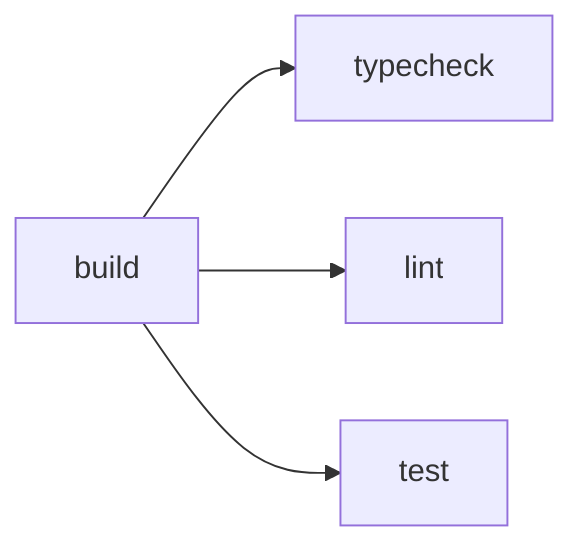

# Architecture Documentation

## Purpose

This document describes the overall system architecture, design patterns, platform abstraction, state management, widget system, and architectural decisions for the Business Dashboard platform.

## Overview

The Business Dashboard is a platform-agnostic dashboard application built as a monorepo using modern web technologies. It supports multiple deployment targets (Web, PWA, Electron Desktop) and provides a widget-based architecture for building customizable dashboards.

### Key Architectural Principles

1. **Platform Agnostic** - Single codebase works on Web, PWA, and Electron
2. **Widget-Based** - Dashboard composed of self-contained, configurable widgets
3. **Multi-Tenant** - Support for multiple tenants with isolated configurations
4. **Type-Safe** - Full TypeScript coverage with strict type checking
5. **Composable** - Modular packages that can be used independently
6. **Developer Experience** - Clear separation of concerns and decision guide

## System Architecture

### High-Level Architecture



### Monorepo Structure

The project uses a monorepo structure managed by Turborepo:

```
latest-app/
├── apps/
│   ├── web/          # Next.js web application
│   └── desktop/      # Electron desktop application
├── packages/
│   ├── core/         # Core platform (Dashboard, Registry, PlatformProvider)
│   ├── sdk/          # Widget SDK (hooks, storage, events, data)
│   ├── ui/           # Reusable UI components
│   ├── widgets/      # Widget implementations
│   ├── config/       # Configuration schemas and data
│   └── testing/      # Testing utilities and mocks
└── coderef/          # Documentation and planning

```

### Package Dependencies



## Design Patterns

### 1. Platform Abstraction Pattern

The platform abstraction layer provides a unified API across different platforms (Web, PWA, Electron).

**Location**: ```packages/core/src/platform/```

#### Capability Detection

```typescript
// Automatically detects platform capabilities
const capabilities = detectCapabilities();
// Returns: { isElectron, isWeb, isPWA, features: {...} }
```

#### Platform Provider

The `PlatformProvider` component wraps the application and provides:
- Platform capabilities detection
- Theme management (light/dark/system)
- Tenant context
- Widget registry access

**Location**: ```packages/core/src/platform/PlatformProvider.tsx```

#### Electron Integration

For Electron, IPC handlers bridge the gap between renderer and main process:

**Main Process** (```apps/desktop/src/ipc/index.ts```):
- Window management
- File system operations
- Native notifications
- Theme synchronization

**Renderer Process** (```packages/sdk/src/electron/```):
- Type-safe Electron API wrapper
- Automatic capability detection

### 2. Widget System Pattern

The widget system follows a registry-based architecture:

#### Widget Registration

```typescript
// Apps register widgets into the registry
const registry = createWidgetRegistry();
registry.register({
  Widget: MyWidget,
  manifest: {
    id: "my-widget",
    name: "My Widget",
    // ...
  }
});
```

#### Widget Rendering

The `LayoutEngine` reads layout configuration and renders widgets:

1. Reads `DashboardLayout` from config
2. For each `WidgetLayoutItem`, looks up widget in registry
3. Wraps widget in `WidgetProvider` with context
4. Positions widget in CSS Grid

**Location**: ```packages/core/src/dashboard/LayoutEngine.tsx```

#### Widget Context

Each widget receives context via `useWidget()` hook:

```typescript
const { config, theme, capabilities, manifest, tenantId } = useWidget();
```

### 3. State Management Pattern

State management uses Zustand with multiple specialized stores:

#### Store Architecture



#### Store Responsibilities

- **App Store** - Sidebar state, user preferences, current tenant, recent widgets
- **Widget Store** - Active widget instances, loading states, focused widget
- **Data Store** - API response caching, request states, TTL management
- **Notification Store** - Toast notifications queue

**Location**: ```packages/core/src/store/```

### 4. Configuration-Driven Pattern

The dashboard is driven by JSON configuration files:

#### Configuration Flow



#### Configuration Structure

- **Tenant Config** (```packages/config/src/tenants/```) - Tenant-specific settings
- **Layout Config** (```packages/config/src/layouts/```) - Widget layout definitions
- **Schema** (```packages/config/src/schema.ts```) - TypeScript validation

### 5. Multi-Tenant Pattern

Multi-tenant support is built into the architecture:

#### Tenant Isolation

- Widget instances are scoped by `tenantId`
- Storage keys are namespaced: `widget:${widgetId}:${key}`
- Store selectors support tenant filtering

#### Tenant Switching

During development, tenants can be switched via `TenantSwitcher` component, which dispatches `platform:tenant-change` events.

## Platform Abstraction

### Capability Detection

**Location**: ```packages/core/src/platform/capabilities.ts```

The system automatically detects:

- **Platform Type**: Electron, Web, or PWA
- **File System Access**: Available in Electron or with File System Access API
- **Notifications**: Native notifications support
- **Offline Support**: Service worker availability
- **System Tray**: Electron-only feature

### Electron IPC Bridge

**Main Process** (```apps/desktop/src/ipc/index.ts```):

IPC handlers registered for:
- Window controls (`window:*`)
- Theme management (`theme:*`)
- File system (`fs:*`)
- Notifications (`notifications:*`)
- App info (`app:*`)

**Renderer Process** (```packages/sdk/src/electron/```):

Type-safe wrapper that:
- Detects Electron environment
- Provides typed API access
- Handles missing APIs gracefully (web fallback)

### Theme Synchronization

The platform synchronizes themes across:

1. **Web**: CSS classes on `document.documentElement`
2. **Electron**: Native theme via `nativeTheme` API
3. **System**: Listens to system preference changes

**Location**: ```packages/core/src/platform/PlatformProvider.tsx``` (lines 104-176)

## State Management

### Zustand Stores

All stores use Zustand with:
- DevTools integration for debugging
- TypeScript for type safety
- Selector helpers for performance

### Store Structure

```typescript
// Store = State + Actions
type Store = State & Actions;

// State: Read-only data
interface State { /* ... */ }

// Actions: Methods that modify state
interface Actions { /* ... */ }
```

### Store Persistence

The App Store uses Zustand's `persist` middleware to save:
- Sidebar collapsed state
- User preferences
- Recent widgets

**Location**: ```packages/core/src/store/appStore.ts```

### Data Caching

The Data Store provides:
- TTL-based caching (default: 5 minutes)
- Automatic expiration
- Request state tracking
- Error handling

**Location**: ```packages/core/src/store/dataStore.ts```

## Widget System

### Widget Lifecycle



### Widget Definition

A widget consists of:

1. **React Component** - The actual widget UI
2. **Manifest** - Metadata (id, name, permissions, data sources)
3. **Registration** - Added to WidgetRegistry

### Widget Context

Widgets receive context via `WidgetProvider`:

```typescript
interface WidgetContext {
  manifest: WidgetManifest;
  config: Record<string, unknown>;
  theme: WidgetTheme;
  capabilities: PlatformCapabilities;
  tenantId?: string;
}
```

### Widget Storage

Widgets have isolated storage:

- Keys are namespaced: `widget:${widgetId}:${key}`
- Supports TTL for expiration
- Observable storage for change notifications

**Location**: ```packages/sdk/src/storage.ts```

### Widget Events

Widgets can emit and listen to lifecycle events:

- `mount` - Widget added to DOM
- `unmount` - Widget removed from DOM
- `config-change` - Configuration updated
- `theme-change` - Theme mode changed
- `visibility-change` - Widget visibility changed
- `resize` - Container size changed

**Location**: ```packages/sdk/src/events.ts```

## Data Access Patterns

### Data Hooks

The SDK provides hooks for data access:

#### REST API Hook

```typescript
const { data, isLoading, refetch } = useRestApi(config, options);
```

Features:
- Automatic caching via Data Store
- Configurable refresh intervals
- TTL management
- Error handling

#### WebSocket Hook

```typescript
const { lastMessage, send, isConnected } = useWebSocket(config, options);
```

Features:
- Auto-reconnect with exponential backoff
- Message buffering
- Connection state management

#### File System Hook

```typescript
const { readFile, writeFile, isAvailable } = useFileSystem(config);
```

Features:
- Electron-only (gracefully handles web)
- File watching
- Binary file support

**Location**: ```packages/sdk/src/data/```

## Code Organization

### Architecture Decision Guide

The project includes a decision guide for where code should go:

**Location**: ```coderef/ARCHITECTURE-GUIDE.md```

#### Decision Tree

1. **Styling/Colors** → `packages/ui/styles/globals.css`
2. **Reusable Building Block** → `packages/ui`
3. **Dashboard Feature** → `packages/widgets`
4. **App Infrastructure** → `packages/core`
5. **JSON Configuration** → `packages/config`

### Package Responsibilities

| Package | Responsibility | Dependencies |
|---------|--------------|--------------|
| `core` | Platform infrastructure, Dashboard, Registry | `sdk`, `ui` |
| `sdk` | Widget SDK, hooks, storage, events | `core` (types only) |
| `ui` | Reusable UI components | None |
| `widgets` | Widget implementations | `sdk`, `ui` |
| `config` | Configuration schemas and data | None |
| `testing` | Test utilities and mocks | All packages |

## Build System

### Turborepo

The project uses Turborepo for monorepo management:

**Configuration**: ```turbo.json```

#### Task Pipeline



#### Task Dependencies

- `build` - Depends on `^build` (build dependencies first)
- `typecheck` - Depends on `^build`
- `lint` - Depends on `^build`
- `test` - Depends on `^build`

### Build Outputs

- `packages/*/dist/` - Compiled packages
- `apps/web/.next/` - Next.js build
- `apps/web/out/` - Static export
- `apps/desktop/dist/` - Electron build

## Development Workflow

### Local Development

1. **Install Dependencies**: `npm install`
2. **Start Dev Server**: `npm run dev` (runs all apps)
3. **Build Packages**: `npm run build`
4. **Run Tests**: `npm test`

### Package Scripts

- `dev` - Start development servers (persistent, no cache)
- `build` - Build all packages and apps
- `typecheck` - Type check all packages
- `lint` - Lint all packages
- `test` - Run tests in watch mode
- `test:run` - Run tests once
- `test:coverage` - Generate coverage report

## Architectural Decisions

### 1. Monorepo Structure

**Decision**: Use Turborepo monorepo  
**Rationale**: 
- Shared code between web and desktop
- Independent versioning of packages
- Efficient builds with caching

### 2. Platform Abstraction

**Decision**: Single codebase for Web and Electron  
**Rationale**:
- Code reuse
- Consistent behavior
- Easier maintenance

### 3. Widget-Based Architecture

**Decision**: Registry-based widget system  
**Rationale**:
- Flexible dashboard composition
- Easy to add/remove widgets
- Configuration-driven layouts

### 4. Zustand for State

**Decision**: Use Zustand instead of Redux  
**Rationale**:
- Simpler API
- Less boilerplate
- Better TypeScript support
- Built-in DevTools

### 5. TypeScript Everywhere

**Decision**: Strict TypeScript with no `any`  
**Rationale**:
- Type safety
- Better IDE support
- Self-documenting code
- Catch errors at compile time

### 6. Configuration-Driven

**Decision**: JSON configuration for layouts  
**Rationale**:
- Easy to modify without code changes
- Support for multiple tenants
- Version control friendly

## Security Considerations

### Widget Permissions

Widgets declare required permissions in their manifest:

- Storage access levels (none, local, sync)
- Network access (none, same-origin, any)
- Notification permissions
- Clipboard, geolocation, media access

**Location**: ```packages/sdk/src/permissions.ts```

### Storage Isolation

- Widget storage is namespaced by widget ID
- No cross-widget data access
- Tenant-scoped isolation

### Electron Security

- Context isolation enabled
- Node integration disabled in renderer
- Preload scripts for safe IPC

## Performance Considerations

### Code Splitting

- Next.js automatic code splitting
- Widget lazy loading (future enhancement)
- Dynamic imports for large components

### Caching Strategy

- Data Store with TTL-based caching
- Automatic cache invalidation
- Request deduplication (future enhancement)

### Rendering Optimization

- React.memo for expensive components
- Zustand selectors for fine-grained subscriptions
- CSS Grid for efficient layout

## Future Enhancements

### Planned Features

1. **Widget Marketplace** - Discover and install widgets
2. **Widget Lazy Loading** - Load widgets on demand
3. **Custom Layouts** - User-defined layouts
4. **Widget Analytics** - Usage tracking
5. **Plugin System** - Extend platform capabilities

### Technical Debt

1. Add widget error boundaries
2. Implement request deduplication
3. Add widget performance monitoring
4. Improve test coverage
5. Add E2E tests

## References

- [Turborepo Documentation](https://turbo.build/repo/docs)
- [Zustand Documentation](https://github.com/pmndrs/zustand)
- [Electron Documentation](https://www.electronjs.org/docs)
- [Next.js Documentation](https://nextjs.org/docs)
- See [API.md](./API.md) for API reference
- See [SCHEMA.md](../schemas/SCHEMA.md) for data models
- See [COMPONENTS.md](./COMPONENTS.md) for component reference


