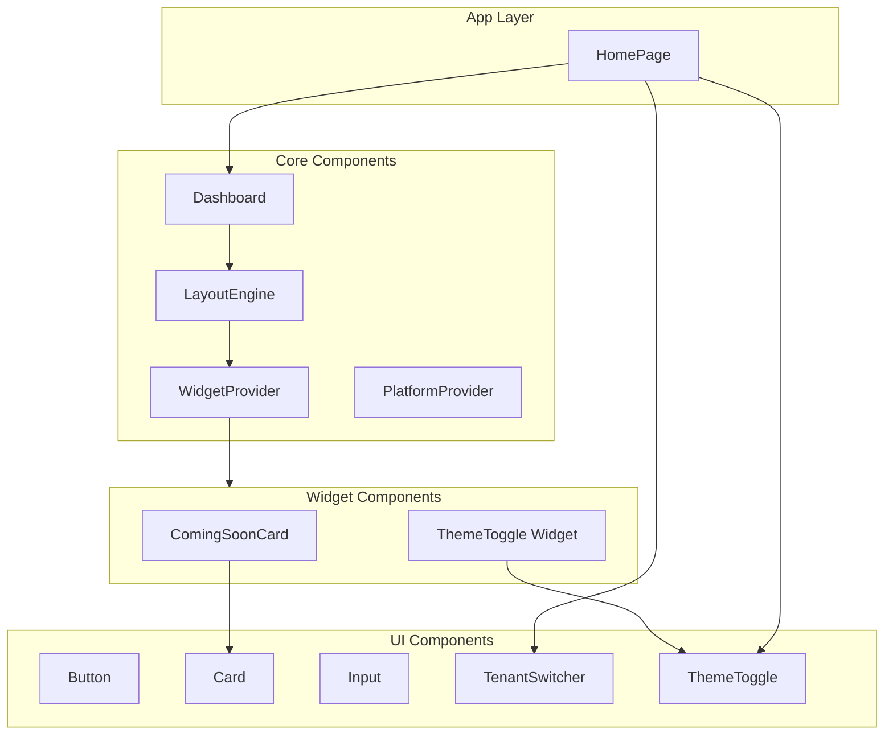

# Components Documentation

## Purpose

This document provides a comprehensive reference for all UI components, widget components, and their hierarchy in the Business Dashboard platform. It covers component props, usage patterns, and relationships between components.

## Overview

The Business Dashboard component system is organized into three main layers:

1. **UI Components** (`@platform/ui`) - Reusable building blocks (buttons, cards, inputs, etc.)
2. **Widget Components** (`@platform/widgets`) - Self-contained dashboard widgets
3. **Core Components** (`@platform/core`) - Dashboard infrastructure (Dashboard, LayoutEngine, WidgetRegistry)

All components follow React best practices with TypeScript, proper prop forwarding, and accessibility support.

## Workflow

### Component Hierarchy



## Core Components

### Dashboard

**Location**: ```packages/core/src/dashboard/Dashboard.tsx```

Main dashboard container component that provides structure around the LayoutEngine.

#### Props

```typescript
interface DashboardProps {
  layout?: DashboardLayout;
  title?: string;
  actions?: ReactNode;
  className?: string;
}
```

#### Usage

```typescript
<Dashboard
  layout={layouts.dashboard}
  title="Business Dashboard"
  actions={<DashboardActions />}
/>
```

#### Sub-components

- **DashboardSkeleton** - Loading skeleton for dashboard

### LayoutEngine

**Location**: ```packages/core/src/dashboard/LayoutEngine.tsx```

Renders widgets from layout configuration in a CSS grid.

#### Props

```typescript
interface LayoutEngineProps {
  layout: DashboardLayout;
  className?: string;
}
```

#### Features

- CSS Grid-based layout system
- Automatic widget positioning from layout config
- Widget error handling (shows error if widget not found)
- Merges default config with instance config

#### Internal Components

- **WidgetWrapper** - Wraps widgets with grid positioning styles

### WidgetRegistry

**Location**: ```packages/core/src/dashboard/WidgetRegistry.ts```

Registry for managing widget definitions.

#### Methods

- `register(definition: WidgetDefinition, source?: string): void`
- `registerAll(definitions: WidgetDefinition[], source?: string): void`
- `unregister(widgetId: string): boolean`
- `get(widgetId: string): WidgetDefinition | undefined`
- `getComponent(widgetId: string): ComponentType | undefined`
- `getManifest(widgetId: string): WidgetManifest | undefined`
- `getAll(): WidgetDefinition[]`
- `getIds(): string[]`
- `getAllManifests(): WidgetManifest[]`
- `has(widgetId: string): boolean`
- `findByCategory(category: string): WidgetDefinition[]`
- `findByTag(tag: string): WidgetDefinition[]`
- `search(query: string): WidgetDefinition[]`
- `subscribe(listener: () => void): () => void`
- `clear(): void`

### PlatformProvider

**Location**: ```packages/core/src/platform/PlatformProvider.tsx```

Provides platform context (theme, capabilities, tenant, registry) to the application.

#### Props

```typescript
interface PlatformProviderProps {
  children: ReactNode;
  registry?: WidgetRegistry;
  defaultTheme?: "light" | "dark" | "system";
  defaultTenant?: string;
}
```

#### Context Value

```typescript
interface PlatformContextValue {
  theme: WidgetTheme;
  capabilities: PlatformCapabilities;
  tenantId: string;
  registry: WidgetRegistry | null;
  setTheme: (theme: "light" | "dark" | "system") => void;
  setTenant: (tenantId: string) => void;
}
```

### WidgetProvider

**Location**: ```packages/sdk/src/useWidget.tsx```

Provides widget-specific context (manifest, config, theme, capabilities) to widget components.

#### Props

```typescript
interface WidgetProviderProps {
  manifest: WidgetManifest;
  config: Record<string, unknown>;
  theme: WidgetTheme;
  capabilities: PlatformCapabilities;
  tenantId?: string;
  children: ReactNode;
}
```

## UI Components

All UI components are located in ```packages/ui/src/components/``` and exported from ```packages/ui/src/components/index.ts```.

### Form Components

#### Button

**Location**: ```packages/ui/src/components/button.tsx```

Versatile button component with multiple variants and sizes.

#### Props

```typescript
interface ButtonProps extends React.ButtonHTMLAttributes<HTMLButtonElement> {
  variant?: "default" | "destructive" | "outline" | "secondary" | "ghost" | "link";
  size?: "default" | "sm" | "lg" | "icon";
  asChild?: boolean;
}
```

#### Variants

- `default` - Primary button with solid background
- `destructive` - Destructive action button (red)
- `outline` - Outlined button with border
- `secondary` - Secondary button with muted background
- `ghost` - Transparent button with hover effect
- `link` - Text button styled as link

#### Sizes

- `default` - Standard size (h-10 px-4 py-2)
- `sm` - Small size (h-9 px-3)
- `lg` - Large size (h-11 px-8)
- `icon` - Square icon button (h-10 w-10)

#### Usage

```typescript
<Button variant="default" size="default">Click me</Button>
<Button variant="outline" size="sm">Small</Button>
<Button variant="ghost" size="icon"><Icon /></Button>
```

#### Input

**Location**: ```packages/ui/src/components/input.tsx```

Text input component.

#### Props

```typescript
interface InputProps extends React.InputHTMLAttributes<HTMLInputElement> {}
```

#### Textarea

**Location**: ```packages/ui/src/components/textarea.tsx```

Multi-line text input component.

#### Props

```typescript
interface TextareaProps extends React.TextareaHTMLAttributes<HTMLTextAreaElement> {}
```

#### Label

**Location**: ```packages/ui/src/components/label.tsx```

Form label component.

#### Select

**Location**: ```packages/ui/src/components/select.tsx```

Dropdown select component with sub-components.

#### Sub-components

- `Select` - Root component
- `SelectGroup` - Group of options
- `SelectValue` - Displayed value
- `SelectTrigger` - Clickable trigger
- `SelectContent` - Dropdown content
- `SelectItem` - Individual option
- `SelectSeparator` - Visual separator

#### Checkbox

**Location**: ```packages/ui/src/components/checkbox.tsx```

Checkbox input component.

#### Switch

**Location**: ```packages/ui/src/components/switch.tsx```

Toggle switch component.

### Feedback Components

#### Alert

**Location**: ```packages/ui/src/components/alert.tsx```

Alert/notification component.

#### Sub-components

- `Alert` - Root container
- `AlertTitle` - Alert title
- `AlertDescription` - Alert description

#### Toast

**Location**: ```packages/ui/src/components/toast.tsx```

Toast notification component with variants.

#### Sub-components

- `Toast` - Root component
- `ToastTitle` - Toast title
- `ToastDescription` - Toast description
- `Toaster` - Toast container/provider
- `toastVariants` - Style variants

#### Props

```typescript
interface ToastProps {
  variant?: "default" | "success" | "error" | "warning" | "info";
}
```

#### Spinner

**Location**: ```packages/ui/src/components/spinner.tsx```

Loading spinner component.

#### Props

```typescript
interface SpinnerProps {
  size?: "sm" | "md" | "lg";
  className?: string;
}
```

#### Skeleton

**Location**: ```packages/ui/src/components/skeleton.tsx```

Loading skeleton component for content placeholders.

### Overlay Components

#### Dialog

**Location**: ```packages/ui/src/components/dialog.tsx```

Modal dialog component.

#### Sub-components

- `Dialog` - Root component
- `DialogPortal` - Portal wrapper
- `DialogOverlay` - Backdrop overlay
- `DialogClose` - Close button
- `DialogTrigger` - Trigger element
- `DialogContent` - Dialog content container
- `DialogHeader` - Header section
- `DialogFooter` - Footer section
- `DialogTitle` - Dialog title
- `DialogDescription` - Dialog description

#### DropdownMenu

**Location**: ```packages/ui/src/components/dropdown.tsx```

Dropdown menu component.

#### Sub-components

- `DropdownMenu` - Root component
- `DropdownMenuTrigger` - Trigger button
- `DropdownMenuContent` - Menu content
- `DropdownMenuItem` - Menu item
- `DropdownMenuLabel` - Section label
- `DropdownMenuSeparator` - Visual separator
- `DropdownMenuGroup` - Item group
- `DropdownMenuPortal` - Portal wrapper
- `DropdownMenuSub` - Submenu
- `DropdownMenuRadioGroup` - Radio group

#### Tooltip

**Location**: ```packages/ui/src/components/tooltip.tsx```

Tooltip component.

#### Sub-components

- `Tooltip` - Root component
- `TooltipTrigger` - Trigger element
- `TooltipContent` - Tooltip content
- `TooltipProvider` - Context provider

### Data Display Components

#### Card

**Location**: ```packages/ui/src/components/card.tsx```

Card container component for grouping content.

#### Sub-components

- `Card` - Root container
- `CardHeader` - Header section (with padding)
- `CardFooter` - Footer section (with padding)
- `CardTitle` - Card title (h3)
- `CardDescription` - Card description text
- `CardContent` - Main content area (with padding)

#### Usage

```typescript
<Card>
  <CardHeader>
    <CardTitle>Card Title</CardTitle>
    <CardDescription>Card description</CardDescription>
  </CardHeader>
  <CardContent>
    Main content here
  </CardContent>
  <CardFooter>
    Footer actions
  </CardFooter>
</Card>
```

#### Badge

**Location**: ```packages/ui/src/components/badge.tsx```

Badge component for labels and status indicators.

#### Props

```typescript
interface BadgeProps extends React.HTMLAttributes<HTMLDivElement> {
  variant?: "default" | "secondary" | "destructive" | "outline";
}
```

### Navigation Components

#### Nav

**Location**: ```packages/ui/src/components/nav.tsx```

Navigation component.

#### Props

```typescript
interface NavProps {
  items: NavItem[];
  className?: string;
}
```

#### Sub-components

- `Nav` - Root component
- `NavItem` - Navigation item
- `NavGroup` - Group of items

#### ThemeToggle

**Location**: ```packages/ui/src/components/theme-toggle.tsx```

Theme toggle component for switching between light/dark/system themes.

#### Props

```typescript
interface ThemeToggleProps {
  mode: "light" | "dark" | "system";
  showLabels?: boolean;
  compact?: boolean;
  className?: string;
  onThemeChange?: (theme: "light" | "dark" | "system") => void;
}
```

#### TenantSwitcher

**Location**: ```packages/ui/src/components/tenant-switcher.tsx```

Dropdown component for switching between tenants during development.

#### Props

```typescript
interface TenantSwitcherProps {
  tenantId: string;
  availableTenants: TenantInfo[];
  onTenantChange?: (tenantId: string) => void;
  className?: string;
}
```

#### TenantInfo

```typescript
interface TenantInfo {
  id: string;
  name: string;
}
```

#### Features

- Displays current tenant name
- Dropdown menu with all available tenants
- Dispatches `platform:tenant-change` custom event
- Visual indicator for current tenant

## Widget Components

Widget components are located in ```packages/widgets/src/``` and follow a consistent structure with a `Widget.tsx` file and a `manifest.ts` file.

### ComingSoonCard

**Location**: ```packages/widgets/src/coming-soon-card/Widget.tsx```

Placeholder card widget for features under development.

#### Props

Uses standard `WidgetProps` from SDK:

```typescript
interface WidgetProps {
  config?: Record<string, unknown>;
  className?: string;
}
```

#### Config Options

- `title` (string) - Card title (default: "Coming Soon")
- `description` (string) - Card description (default: "This feature is under development.")
- `icon` (string) - Icon key: "rocket", "chart", "bell", "calendar", "settings", or "default" (default: "rocket")

#### Usage

```typescript
// In layout config
{
  widgetId: "coming-soon-card",
  instanceId: "coming-soon-1",
  config: {
    title: "New Feature",
    description: "This will be available soon.",
    icon: "rocket"
  }
}
```

#### Features

- Configurable title and description
- Multiple icon options
- Responsive design with dark mode support
- "Coming Soon" badge indicator

### ThemeToggle Widget

**Location**: ```packages/widgets/src/theme-toggle/Widget.tsx```

Widget wrapper for the ThemeToggle UI component.

#### Props

Uses standard `WidgetProps` from SDK.

#### Config Options

- `showLabels` (boolean) - Show theme labels (default: true)
- `compact` (boolean) - Use compact layout (default: false)

#### Usage

```typescript
// In layout config
{
  widgetId: "theme-toggle",
  instanceId: "theme-toggle-1",
  config: {
    showLabels: false,
    compact: true
  }
}
```

#### Features

- Wraps `ThemeToggle` from `@platform/ui`
- Accesses theme from widget context
- Configurable display options

## Component Patterns

### Composition Pattern

Components are designed for composition:

```typescript
<Card>
  <CardHeader>
    <CardTitle>Title</CardTitle>
  </CardHeader>
  <CardContent>
    <Button>Action</Button>
  </CardContent>
</Card>
```

### Variant Pattern

Many components use `class-variance-authority` for variant management:

```typescript
const buttonVariants = cva(
  "base-classes",
  {
    variants: {
      variant: { default: "...", outline: "..." },
      size: { default: "...", sm: "..." }
    }
  }
);
```

### Forward Ref Pattern

All components use `React.forwardRef` for proper ref forwarding:

```typescript
const Component = React.forwardRef<HTMLElement, Props>(
  ({ className, ...props }, ref) => (
    <element ref={ref} className={cn(baseClasses, className)} {...props} />
  )
);
```

### Display Name Pattern

All components set `displayName` for debugging:

```typescript
Component.displayName = "Component";
```

## Component Usage Examples

### Creating a Custom Widget

```typescript
"use client";

import { useWidget, type WidgetProps } from "@platform/sdk";
import { Card, CardHeader, CardTitle, CardContent } from "@platform/ui";

export function Widget({ className = "" }: WidgetProps) {
  const { config, theme, capabilities } = useWidget();
  
  return (
    <Card className={className}>
      <CardHeader>
        <CardTitle>{config.title as string}</CardTitle>
      </CardHeader>
      <CardContent>
        <p>Widget content here</p>
      </CardContent>
    </Card>
  );
}
```

### Using UI Components

```typescript
import { Button, Card, Input, Alert } from "@platform/ui";

function MyComponent() {
  return (
    <Card>
      <CardHeader>
        <CardTitle>Form</CardTitle>
      </CardHeader>
      <CardContent>
        <Input placeholder="Enter text" />
        <Button variant="default">Submit</Button>
      </CardContent>
    </Card>
  );
}
```

### Dashboard with Custom Actions

```typescript
import { Dashboard } from "@platform/core";
import { TenantSwitcher, ThemeToggle } from "@platform/ui";

function HomePage() {
  return (
    <Dashboard
      layout={layouts.dashboard}
      title="Business Dashboard"
      actions={
        <div className="flex gap-2">
          <TenantSwitcher tenantId="default" availableTenants={tenants} />
          <ThemeToggle mode="system" />
        </div>
      }
    />
  );
}
```

## Styling

All components use Tailwind CSS with CSS variables for theming. Components automatically adapt to light/dark mode based on the theme context.

### CSS Variables

Components use semantic color variables:
- `bg-primary`, `text-primary-foreground`
- `bg-secondary`, `text-secondary-foreground`
- `bg-muted`, `text-muted-foreground`
- `bg-accent`, `text-accent-foreground`
- `border-input`, `ring-ring`

### Utility Function

Components use the `cn` utility from ```packages/ui/src/lib/utils.ts``` for conditional class merging (combines `clsx` and `tailwind-merge`).

## References

- [React Documentation](https://react.dev)
- [Radix UI Primitives](https://www.radix-ui.com/primitives)
- [Tailwind CSS](https://tailwindcss.com)
- See [API.md](./API.md) for widget SDK APIs
- See [SCHEMA.md](../schemas/SCHEMA.md) for data models
- See [V2-MAPPING.md](../schemas/V2-COMPONENT-MAPPING.md) for Next.js mapping
- See [ARCHITECTURE.md](./ARCHITECTURE.md) for component architecture

