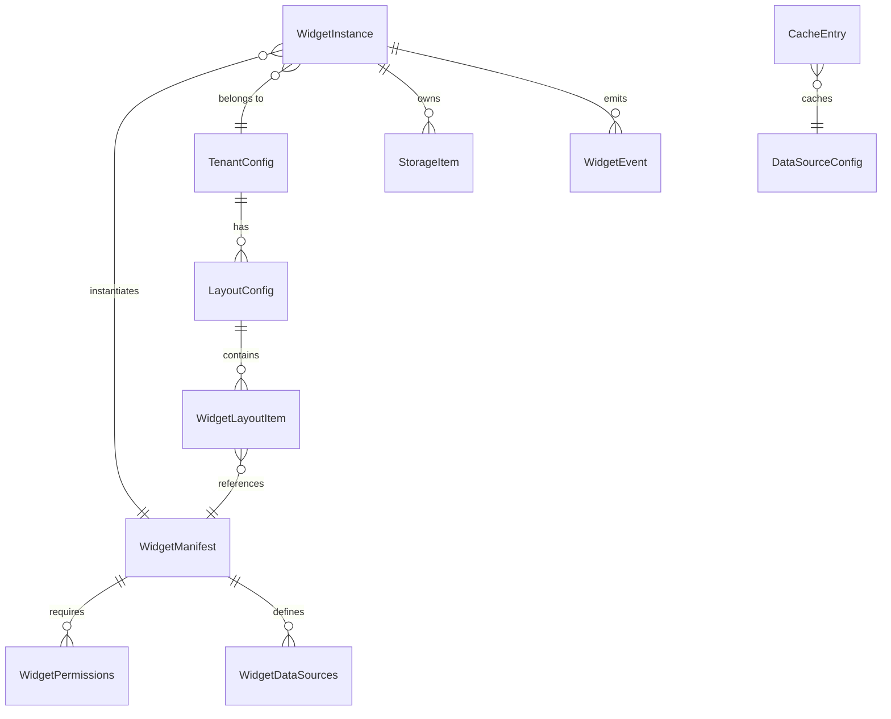

# Schema Documentation

## Purpose

This document defines all data models, TypeScript interfaces, entity relationships, and validation schemas used throughout the Business Dashboard platform. It serves as a reference for understanding the structure of data flowing through the system.

## Overview

The Business Dashboard uses a type-safe schema system built on TypeScript interfaces. The schemas are organized into several categories:

1. **Widget System** - Widget manifests, definitions, and layout configurations
2. **Configuration** - Tenant and layout configuration schemas
3. **State Management** - Zustand store state types
4. **Data Sources** - REST, WebSocket, and FileSystem configurations
5. **Permissions** - Widget permission models
6. **Events** - Widget lifecycle and event types
7. **Storage** - Widget storage item schemas

## Workflow

### Entity Relationship Diagram



## Widget System Schemas

### WidgetManifest

Defined in ```8:38:packages/sdk/src/types.ts```.

The widget manifest describes metadata about a widget:

```typescript
interface WidgetManifest {
  id: string;                    // Unique identifier (e.g., "coming-soon-card")
  name: string;                  // Display name
  description: string;            // Brief description
  version: string;                // Semantic version
  author?: string;                // Author or organization
  icon?: string;                 // Widget icon (URL or component name)
  category?: string;              // Category for marketplace organization
  tags?: string[];               // Tags for search and filtering
  permissions?: WidgetPermissions; // Required permissions
  dataSources?: WidgetDataSources; // Data source configurations
  defaultConfig?: Record<string, unknown>; // Default configuration values
  size?: {
    minWidth?: number;
    minHeight?: number;
    maxWidth?: number;
    maxHeight?: number;
  };
}
```

### WidgetDefinition

Defined in ```102:107:packages/sdk/src/types.ts```.

Combines a React component with its manifest:

```typescript
interface WidgetDefinition {
  Widget: ComponentType<WidgetProps>;
  manifest: WidgetManifest;
}
```

### WidgetProps

Defined in ```92:97:packages/sdk/src/types.ts```.

Props passed to widget components:

```typescript
interface WidgetProps {
  config?: Record<string, unknown>;
  className?: string;
}
```

### WidgetContext

Defined in ```76:87:packages/sdk/src/types.ts```.

Context provided to widgets via `useWidget` hook:

```typescript
interface WidgetContext {
  manifest: WidgetManifest;
  config: Record<string, unknown>;
  theme: WidgetTheme;
  capabilities: PlatformCapabilities;
  tenantId?: string;
}
```

### WidgetTheme

Defined in ```66:71:packages/sdk/src/types.ts```.

Theme information passed to widgets:

```typescript
interface WidgetTheme {
  mode: "light" | "dark" | "system";
  resolved: "light" | "dark";
}
```

### PlatformCapabilities

Defined in ```43:61:packages/sdk/src/types.ts```.

Platform capabilities available to widgets:

```typescript
interface PlatformCapabilities {
  isElectron: boolean;
  isWeb: boolean;
  isPWA: boolean;
  features: {
    fileSystem: boolean;
    notifications: boolean;
    systemTray: boolean;
    offline: boolean;
  };
}
```

### WidgetLayoutItem

Defined in ```112:127:packages/sdk/src/types.ts```.

Layout position for a widget instance:

```typescript
interface WidgetLayoutItem {
  widgetId: string;              // Reference to widget ID from manifest
  instanceId: string;            // Unique instance ID
  column?: number;               // Grid column position
  row?: number;                  // Grid row position
  colSpan?: number;              // Column span
  rowSpan?: number;               // Row span
  config?: Record<string, unknown>; // Instance-specific configuration
}
```

### DashboardLayout

Defined in ```132:143:packages/sdk/src/types.ts```.

Dashboard layout configuration:

```typescript
interface DashboardLayout {
  id: string;
  name: string;
  columns?: number;              // Grid column count (default: 12)
  gap?: number;                   // Gap between widgets in pixels
  widgets: WidgetLayoutItem[];
}
```

## Configuration Schemas

### WidgetPosition

Defined in ```4:19:packages/config/src/schema.ts```.

Widget position in layout grid:

```typescript
interface WidgetPosition {
  widgetId: string;
  instanceId?: string;            // Auto-generated if not provided
  column?: number;                // Grid column (1-based)
  row?: number;                  // Grid row (1-based)
  colSpan?: number;              // Column span
  rowSpan?: number;              // Row span
  config?: Record<string, unknown>; // Instance-specific config overrides
}
```

### LayoutConfig

Defined in ```24:37:packages/config/src/schema.ts```.

Layout configuration schema:

```typescript
interface LayoutConfig {
  id: string;
  name: string;
  description?: string;
  columns?: number;              // Grid columns (default: 12)
  gap?: number;                  // Gap between widgets in pixels (default: 16)
  widgets: WidgetPosition[];
}
```

### TenantConfig

Defined in ```42:69:packages/config/src/schema.ts```.

Tenant configuration schema:

```typescript
interface TenantConfig {
  id: string;
  name: string;
  logo?: string;                 // Tenant logo URL
  defaultLayout: string;         // Primary layout to use
  layouts?: string[];             // Available layouts for this tenant
  features?: {
    customizeDashboard?: boolean; // Can users customize dashboard
    marketplace?: boolean;        // Show marketplace
    darkMode?: boolean;           // Enable dark mode
  };
  theme?: {
    primaryColor?: string;        // Primary color (CSS color value)
    accentColor?: string;         // Accent color (CSS color value)
  };
}
```

**Example** (from ```packages/config/src/tenants/default.json```):
```json
{
  "id": "default",
  "name": "Business Dashboard",
  "defaultLayout": "main-dashboard",
  "layouts": ["main-dashboard"],
  "features": {
    "customizeDashboard": false,
    "marketplace": false,
    "darkMode": true
  }
}
```

### AppConfig

Defined in ```74:85:packages/config/src/schema.ts```.

Application configuration schema:

```typescript
interface AppConfig {
  appName: string;
  version: string;
  defaultTenant: string;
  tenants: Record<string, TenantConfig>;
  layouts: Record<string, LayoutConfig>;
}
```

## State Management Schemas

### App Store

Defined in ```packages/core/src/store/types.ts```.

#### UserPreferences

```typescript
interface UserPreferences {
  dateFormat: "MM/DD/YYYY" | "DD/MM/YYYY" | "YYYY-MM-DD";
  currency: string;
  locale: string;
}
```

#### AppState

```typescript
interface AppState {
  sidebarCollapsed: boolean;
  currentTenant: string | null;
  preferences: UserPreferences;
  recentWidgets: string[];
}
```

#### AppActions

```typescript
interface AppActions {
  toggleSidebar: () => void;
  setSidebarCollapsed: (collapsed: boolean) => void;
  setCurrentTenant: (tenantId: string | null) => void;
  setPreferences: (preferences: Partial<UserPreferences>) => void;
  addRecentWidget: (widgetId: string) => void;
  reset: () => void;
}
```

### Widget Store

Defined in ```packages/core/src/store/types.ts```.

#### WidgetInstance

```typescript
interface WidgetInstance {
  id: string;                    // Unique instance ID
  tenantId: string;              // Tenant ID for multi-tenant isolation
  widgetId: string;               // Widget type from registry
  config: Record<string, unknown>; // Instance configuration
  loadingState: "idle" | "loading" | "success" | "error";
  error: string | null;
  lastUpdated: number;           // Timestamp
}
```

#### WidgetState

```typescript
interface WidgetState {
  instances: Record<string, WidgetInstance>;
  focusedWidget: string | null;
}
```

#### WidgetActions

```typescript
interface WidgetActions {
  addWidget: (instance: Omit<WidgetInstance, "loadingState" | "error" | "lastUpdated">) => void;
  removeWidget: (instanceId: string) => void;
  updateWidgetConfig: (instanceId: string, config: Record<string, unknown>) => void;
  setWidgetLoading: (instanceId: string, state: WidgetLoadingState, error?: string) => void;
  setFocusedWidget: (instanceId: string | null) => void;
  clearWidgets: () => void;
}
```

### Notification Store

Defined in ```packages/core/src/store/types.ts```.

#### Toast

```typescript
interface Toast {
  id: string;
  title: string;
  description?: string;
  variant: "default" | "success" | "error" | "warning" | "info";
  duration: number;              // ms (0 = no auto-dismiss)
  createdAt: number;
}
```

#### NotificationState

```typescript
interface NotificationState {
  toasts: Toast[];
  maxToasts: number;
}
```

### Data Store

Defined in ```packages/core/src/store/types.ts```.

#### CacheEntry

```typescript
interface CacheEntry<T = unknown> {
  data: T;
  cachedAt: number;
  ttl: number;                   // Time to live in ms
  key: string;
}
```

#### DataState

```typescript
interface DataState {
  cache: Record<string, CacheEntry>;
  requestStates: Record<string, "idle" | "pending" | "success" | "error">;
  errors: Record<string, string | null>;
}
```

**Default TTL**: 5 minutes (300,000 ms)

## Data Source Schemas

### DataSourceConfig

Defined in ```17:24:packages/sdk/src/data/types.ts```.

Base data source configuration:

```typescript
interface DataSourceConfig {
  type: "rest" | "websocket" | "filesystem";
  id: string;
  enabled?: boolean;
}
```

### RestApiConfig

Defined in ```34:48:packages/sdk/src/data/types.ts```.

REST API configuration:

```typescript
interface RestApiConfig extends DataSourceConfig {
  type: "rest";
  url: string;
  method?: "GET" | "POST" | "PUT" | "PATCH" | "DELETE";
  headers?: Record<string, string>;
  refreshInterval?: number;      // ms (0 = no refresh)
  cacheTtl?: number;            // ms (uses dataStore)
  timeout?: number;              // ms
}
```

### WebSocketConfig

Defined in ```91:107:packages/sdk/src/data/types.ts```.

WebSocket configuration:

```typescript
interface WebSocketConfig extends DataSourceConfig {
  type: "websocket";
  url: string;
  protocols?: string | string[];
  reconnect?: boolean;
  maxReconnectAttempts?: number; // 0 = infinite
  reconnectDelay?: number;       // ms
  maxReconnectDelay?: number;     // ms
  heartbeatInterval?: number;     // ms (0 = disabled)
}
```

### FileSystemConfig

Defined in ```153:159:packages/sdk/src/data/types.ts```.

File system configuration (Electron only):

```typescript
interface FileSystemConfig extends DataSourceConfig {
  type: "filesystem";
  basePath?: string;
  allowedExtensions?: string[];
}
```

### FileInfo

Defined in ```162:175:packages/sdk/src/data/types.ts```.

File information:

```typescript
interface FileInfo {
  name: string;
  path: string;
  size: number;                 // bytes
  isDirectory: boolean;
  modifiedAt: number;           // timestamp
  createdAt: number;            // timestamp
}
```

### WidgetDataSources

Defined in ```225:232:packages/sdk/src/data/types.ts```.

Widget data sources configuration:

```typescript
interface WidgetDataSources {
  rest?: RestApiConfig[];
  websocket?: WebSocketConfig[];
  filesystem?: FileSystemConfig[];
}
```

## Permission Schemas

### WidgetPermissions

Defined in ```19:63:packages/sdk/src/permissions.ts```.

Widget permissions model:

```typescript
interface WidgetPermissions {
  storage?: "none" | "local" | "sync";
  network?: "none" | "same-origin" | "any";
  notifications?: "none" | "basic" | "full";
  clipboard?: boolean;
  geolocation?: boolean;
  media?: boolean;
  custom?: Record<string, boolean>;
}
```

**Default Permissions** (most restrictive):
```typescript
{
  storage: "none",
  network: "none",
  notifications: "none",
  clipboard: false,
  geolocation: false,
  media: false,
}
```

## Event Schemas

### WidgetEventType

Defined in ```4:10:packages/sdk/src/events.ts```.

Widget lifecycle event types:

```typescript
type WidgetEventType =
  | "mount"
  | "unmount"
  | "config-change"
  | "theme-change"
  | "visibility-change"
  | "resize";
```

### WidgetEventPayload

Defined in ```15:22:packages/sdk/src/events.ts```.

Base event payload:

```typescript
interface WidgetEventPayload {
  type: WidgetEventType;
  timestamp: number;
  instanceId: string;
}
```

### WidgetEvent

Defined in ```83:89:packages/sdk/src/events.ts```.

Union of all widget events:

```typescript
type WidgetEvent =
  | WidgetMountEvent
  | WidgetUnmountEvent
  | WidgetConfigChangeEvent
  | WidgetThemeChangeEvent
  | WidgetVisibilityChangeEvent
  | WidgetResizeEvent;
```

#### WidgetMountEvent

```typescript
interface WidgetMountEvent extends WidgetEventPayload {
  type: "mount";
}
```

#### WidgetUnmountEvent

```typescript
interface WidgetUnmountEvent extends WidgetEventPayload {
  type: "unmount";
}
```

#### WidgetConfigChangeEvent

```typescript
interface WidgetConfigChangeEvent extends WidgetEventPayload {
  type: "config-change";
  previousConfig: Record<string, unknown>;
  newConfig: Record<string, unknown>;
}
```

#### WidgetThemeChangeEvent

```typescript
interface WidgetThemeChangeEvent extends WidgetEventPayload {
  type: "theme-change";
  previousTheme: "light" | "dark";
  newTheme: "light" | "dark";
}
```

#### WidgetVisibilityChangeEvent

```typescript
interface WidgetVisibilityChangeEvent extends WidgetEventPayload {
  type: "visibility-change";
  isVisible: boolean;
}
```

#### WidgetResizeEvent

```typescript
interface WidgetResizeEvent extends WidgetEventPayload {
  type: "resize";
  width: number;
  height: number;
}
```

## Storage Schemas

### StorageItem

Defined in ```4:13:packages/sdk/src/storage.ts```.

Storage item with metadata:

```typescript
interface StorageItem<T = unknown> {
  value: T;
  createdAt: number;
  updatedAt: number;
  expiresAt?: number;            // Optional expiration timestamp
}
```

### StorageSetOptions

Defined in ```18:21:packages/sdk/src/storage.ts```.

Storage options for set operations:

```typescript
interface StorageSetOptions {
  ttl?: number;                  // Time-to-live in milliseconds
}
```

### StorageChangeEvent

Defined in ```74:83:packages/sdk/src/storage.ts```.

Storage change event:

```typescript
interface StorageChangeEvent {
  type: "set" | "remove" | "clear";
  key?: string;                  // undefined for clear
  previousValue?: unknown;
  newValue?: unknown;
}
```

## Validation Functions

### Layout Validation

Defined in ```110:125:packages/config/src/schema.ts```.

```typescript
function validateLayout(layout: unknown): layout is LayoutConfig
```

Validates that a layout configuration has:
- Valid `id` (non-empty string)
- Valid `name` (non-empty string)
- Valid `widgets` array with objects containing `widgetId` (string)

### Tenant Validation

Defined in ```130:140:packages/config/src/schema.ts```.

```typescript
function validateTenant(tenant: unknown): tenant is TenantConfig
```

Validates that a tenant configuration has:
- Valid `id` (non-empty string)
- Valid `name` (non-empty string)
- Valid `defaultLayout` (non-empty string)

### Permission Checking

Defined in ```80:110:packages/sdk/src/permissions.ts```.

```typescript
function hasPermission(
  permissions: WidgetPermissions | undefined,
  permission: keyof WidgetPermissions,
  level?: string
): boolean
```

Checks if a widget has a specific permission, with support for tiered permissions (storage, network, notifications).

## Examples

### Complete Widget Manifest

```typescript
const manifest: WidgetManifest = {
  id: "sales-chart",
  name: "Sales Chart",
  description: "Displays sales data in a chart",
  version: "1.0.0",
  author: "Business Dashboard Team",
  category: "analytics",
  tags: ["chart", "sales", "data"],
  permissions: {
    storage: "local",
    network: "same-origin",
  },
  dataSources: {
    rest: [{
      type: "rest",
      id: "sales-api",
      url: "/api/sales",
      method: "GET",
      refreshInterval: 60000,
    }],
  },
  defaultConfig: {
    chartType: "line",
    timeRange: "7d",
  },
  size: {
    minWidth: 4,
    minHeight: 3,
  },
};
```

### Layout Configuration

```typescript
const layout: LayoutConfig = {
  id: "main-dashboard",
  name: "Main Dashboard",
  description: "Default dashboard layout",
  columns: 12,
  gap: 16,
  widgets: [
    {
      widgetId: "sales-chart",
      instanceId: "sales-chart-1",
      column: 1,
      colSpan: 8,
      row: 1,
      rowSpan: 4,
      config: {
        chartType: "bar",
      },
    },
    {
      widgetId: "revenue-card",
      instanceId: "revenue-card-1",
      column: 9,
      colSpan: 4,
      row: 1,
    },
  ],
};
```

## References

- [TypeScript Handbook](https://www.typescriptlang.org/docs/handbook/intro.html)
- See [API.md](./API.md) for API usage examples
- See [ARCHITECTURE.md](./ARCHITECTURE.md) for system design
- See [COMPONENTS.md](./COMPONENTS.md) for component schemas
